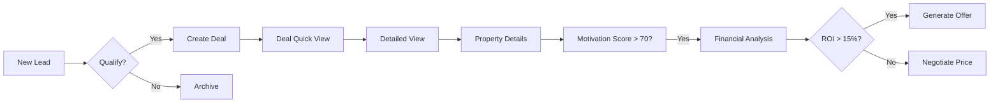
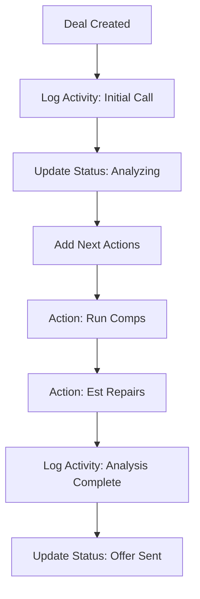

# Deal Management Features Guide

This guide details the new Deal Management capabilities, including the Deal Quick View, Detailed Deal View, and Analytical Tools.

## 1. Deal Quick View
The Deals Dashboard now provides a high-level "Quick View" card for each opportunity, allowing investors to scan key metrics without navigating away.

**Key Features:**
*   **Status Indicator**: Quickly see if a deal is "Analyzing", "Under Contract", etc.
*   **Property Specs**: Beds, Baths, and Sqft displayed prominently.
*   **Financial Snapshot**: Purchase Price, Repair Estimate, and ARV.
*   **Action**: "View Details" button to dive deeper.

*Annotated Screenshot: Callout showing Purchase Price vs ARV spread.*

---

## 2. Detailed Deal View
The Detailed Deal View is organized into a tabbed interface to manage different aspects of the transaction efficiently.

### Header Section
*   **Navigation**: Breadcrumbs for easy return to the deals list.
*   **Actions**: "Run Comps", "Generate Offer", "Call Owner", "Edit".
*   **Photo Gallery**: Quick access to property visuals.

### Tabbed Interface

#### A. Property Details Tab
Focuses on the physical and ownership aspects.
*   **Facts**: Year Built, Occupancy Status.
*   **Owner Information**: Contact details and mailing address (linked from Lead).
*   **Motivation Analysis**:
    *   **Scoring System**: Calculates a "Motivation Score" (0-100) based on factors like "Vacant", "Out of State", etc.
    *   **Visual Indicators**: High/Medium/Low motivation status.

*Annotated Screenshot: Highlight on Motivation Score and Owner Info sidebar.*

#### B. Financial Analysis Tab
Deep dive into the numbers.
*   **Valuation Inputs**: Editable Purchase Price, ARV, Repairs.
*   **ROI Analysis**:
    *   **Projected Profit**: Calculated based on the 70% rule.
    *   **ROI %**: Return on Cash calculation.
    *   **MAO Meter**: Visual bar showing how close the Purchase Price is to the Max Allowable Offer.

*Annotated Screenshot: Callout explaining the ROI calculation and MAO meter.*

#### C. Activity Log Tab
Tracks the lifecycle of the deal.
*   **Timeline**: Chronological view of stage changes (e.g., "Negotiation" -> "Under Contract").
*   **Next Actions**: Checklist for the current stage.
*   **Time in Stage**: Days elapsed in the current status to prevent stagnation.

---

## 3. Workflows

### Deal Analysis Workflow
How a user moves from a new lead to an offer.

### Activity Tracking Workflow
Managing the deal lifecycle.

## 4. Technical Implementation Notes
*   **Database**: Extended `properties` table with specs and motivation JSONB. New `deal_activities` table.
*   **Frontend**: React components with `lucide-react` icons. Real-time ROI calculation in the browser.
